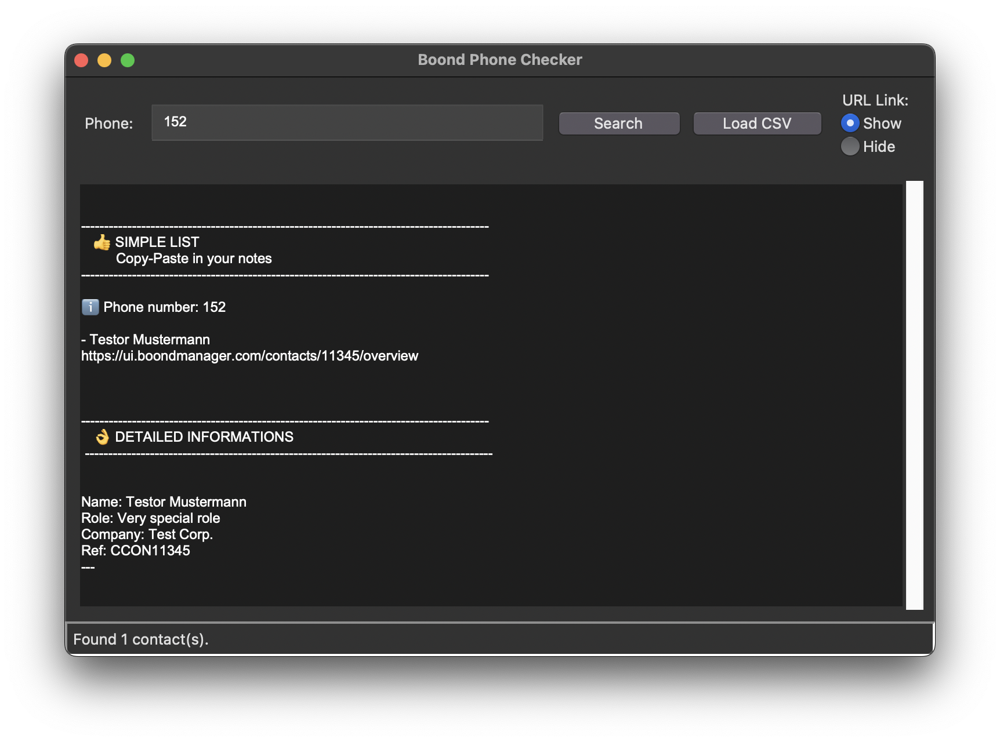

# Boond Phone Checker
A simple desktop utility to quickly look up contact information from a Boond Manager CSV export using a full or partial phone number.



This tool loads contact data from a user-selected CSV file, automatically handling various phone number formats and detecting if the CSV headers are in English or French. Search results include the contact's details and a direct link to their Boond profile.

## Setup & Usage
Prepare CSV: Export your contacts from Boond Manager as a semicolon-delimited (;) CSV file. The script expects columns like Phone 1, Last Name, First Name, Internal reference, etc.

## Run Script:
```
python3 phone_lookup.py
```
Search: In the app, click Load CSV to select your file, then enter a phone number and press Enter to search.

## Configuration
The script can be easily configured by modifying the CONFIG dictionary and DEFAULT_CSV_FILE variable within phone_lookup.py to match your specific CSV format.

## Compiling into an Executable
To create a standalone application, you can use pyinstaller.

Install PyInstaller:
```
pip install pyinstaller
```
Run Compilation Command:
```
pyinstaller --windowed --onefile --name="Phone Lookup" "phone_lookup.py"
```
The final executable will be in the dist folder.

## Contributing
This is a simplified tool, and you are welcome to copy, modify, and improve it. Feel free to fork the repository and adapt it to your own needs.
